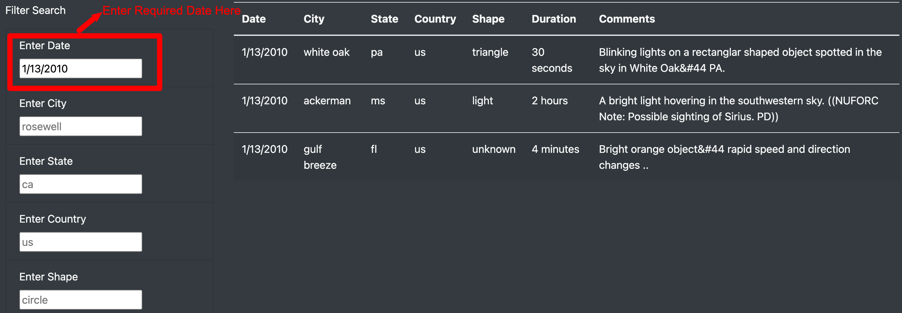

# UFOs

## Overview of the Project

For an article on McMinnville, Oregon, this project is to build a webpage detailing information on UFOs and UFO sightings. An initial dataset was collected with details of the sightings on a period of time.

As part of this project a professional webpage was required with the details. The data collected can be put as a table, but additional dynamic filtering is required to enable users to quickly analyze through the data for their interest using filters.

## Resources
- Data Source: data.js
- Software: Python 3.9.7, Visual Code, javascript, bootstrap, html
---

## Results

The webpage was built using javascript and bootstrap styles giving the dynamic webpage a very aesthetic. Dynamic filters were added to filter the data using anyone or more of the following attributes:
1. Date
2. City
3. State
4. Country
5. Shape 

### Process to Perform a Search

1. Below the details on UFO and few details on the topic, there is a table of all UFO sightings with filter options in the left side. By default no filter options are added. 

    

2. In the filter options as an example a specific date criteria can be added in the Date Section. Once the date is entered click outside the textbox or tab out to enable the criteria.

    

3. We can add additional criteria in the same way, for example in the below case state code was added as an additional filter criteria

    

4. Previous Filter criterias can also be removed.

    

5. UFO Sightings in the top can be clicked or the page can be refreshed to clear all filters in one click and start from beginning.

6. Below is a gif image showing the flow to search using filters and finally resetting all of it.

    

---

## Summary

A very impressive dynamic webpage was built as part of this project providing all the planned features required for the article

Drawback: 

1. One key drawback of this webpage is that the data is provided from a static file and any changes to the data will require an update to the data.js file.

Recommendations:

1. Store all UFO sightings information into a database. With this any new sightings information can be directing updated into the database table which inturn will automatically update this webpage. 

2. Adding additional details on latest news articles on UFO's and UFO sightings will provide more interests. For this a webscraping module can be build to collect details from existing websites.

3. Additional summary metrics can be provided using data engineering from the table with details like:
    - Count of sightings by year
    - Most common shape observed
    - Average duration encountered
    - Counts by City, Stage, Country
    - Graphs on sightings by time

